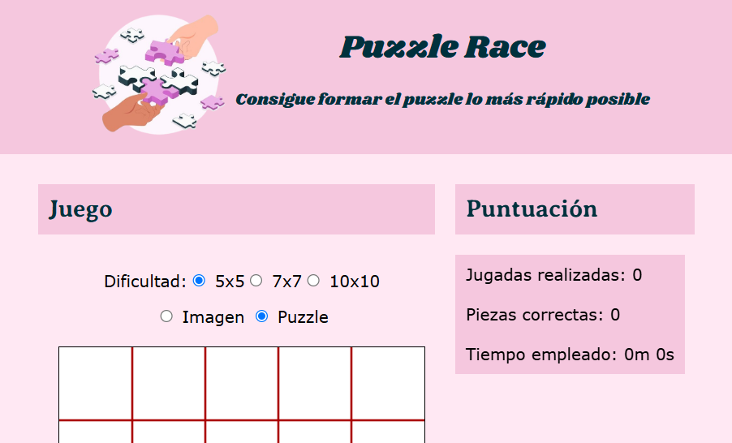

# 🧩 Web Puzzle

Juego de rompecabezas interactivo desarrollado utilizando **HTML**, **CSS** y **JavaScript**. 

## 🚀 Características

- **Interfaz Interactiva**: Interactuar directamente con el puzzle mediante funcionalidades de arrastrar y soltar.
- **Diseño Responsivo**: Adaptable a diferentes dispositivos y tamaños de pantalla.
- **Animaciones Suaves**: Implementadas con CSS para transiciones y movimientos fluidos.

## 🛠️ Tecnologías Utilizadas

- **HTML5**: Estructura y contenido del juego.
- **CSS3**: Estilos y diseño visual.
- **JavaScript (ES6+)**: Lógica del juego y funcionalidades interactivas.

## 📂 Estructura del Proyecto

- css/: Contiene los archivos de estilos CSS.​
- font/: Incluye las fuentes utilizadas en el proyecto.​
- img/: Almacena las imágenes necesarias para el juego.​
- js/: Contiene los scripts de JavaScript que manejan la lógica del juego.​
- styles/: Carpeta adicional para estilos específicos.​
- acerca.html: Página con información adicional sobre el proyecto.​
- index.html: Página principal donde se encuentra el juego.


## 📸 Captura de Pantalla



## 🏗️ Instalación y Uso
### Clonar el Repositorio

```sh
git clone https://github.com/vancovx/Web-Puzzle.git
cd Web-Puzzle
```

### Cómo Jugar
1️⃣ **Acceder al Juego**: Abre el archivo `index.html` en tu navegador preferido.  
2️⃣ **Interacción**: Utiliza el ratón o el tacto (en dispositivos compatibles) para mover las piezas del puzzle.  
3️⃣ **Objetivo**: Coloca todas las piezas en la posición correcta para completar la imagen.  


## 👥 Autor -> Vanessa Covrig

